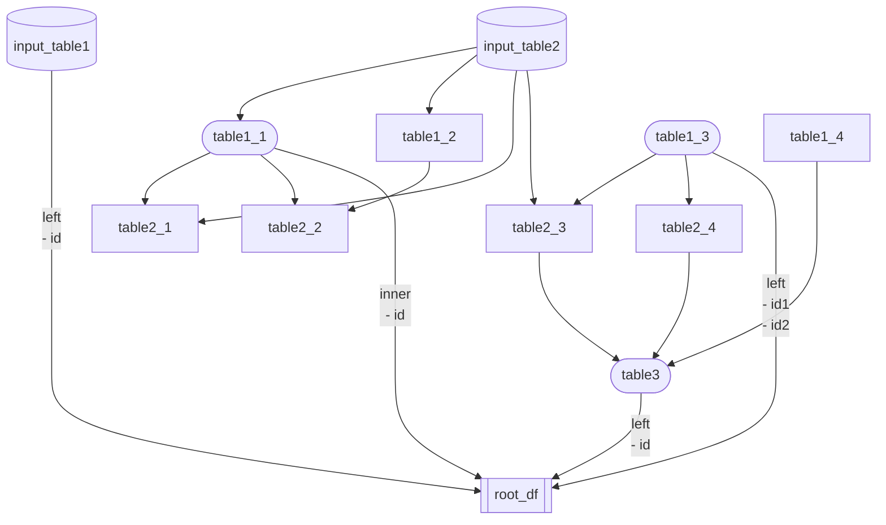

## ComplecatedDataHub
This is example of visualizing data processing flow

### ComplecatedDataHub detail
| order | name | table type | join | keys | descriotion |
| :-: | :-: | :-: | :-: | :-: | :-: |
| -1 | input_table1 | input | left | id |  |
| -1 | input_table2 | input |  |  |  |
| 0 | table1_1 | function | inner | id | Description of table1_1 |
| 0 | table1_2 | function |  |  |  |
| 0 | table1_3 | function | left | id1, id2 | Description of table1_3 |
| 0 | table1_4 | function |  |  | multi lines description of table1_4 multi lines description of table1_4 |
| 1 | table2_1 | function |  |  |  |
| 1 | table2_2 | function |  |  |  |
| 1 | table2_3 | function |  |  | Description of table2_3 |
| 1 | table2_4 | function |  |  | Description of table2_4 |
| 2 | table3 | function | left | id | Description of table3 |

### Dataflow image

